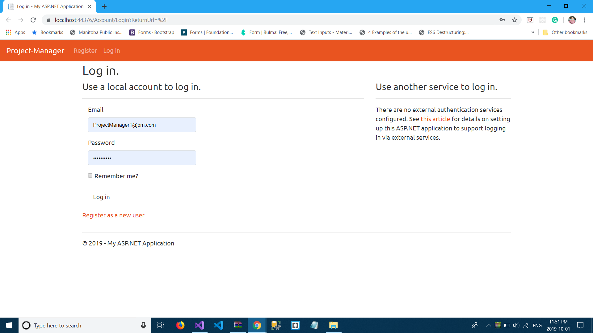
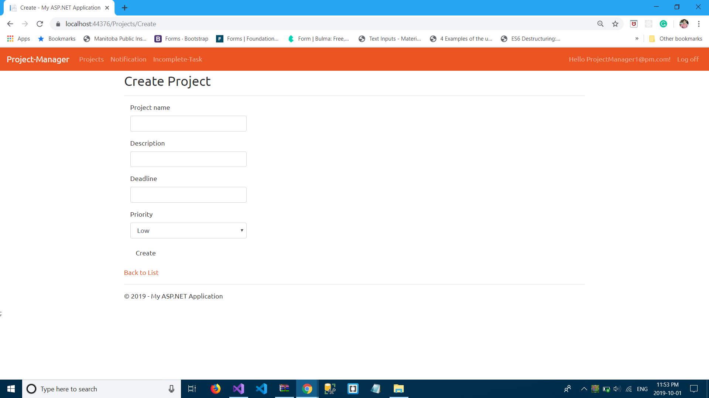
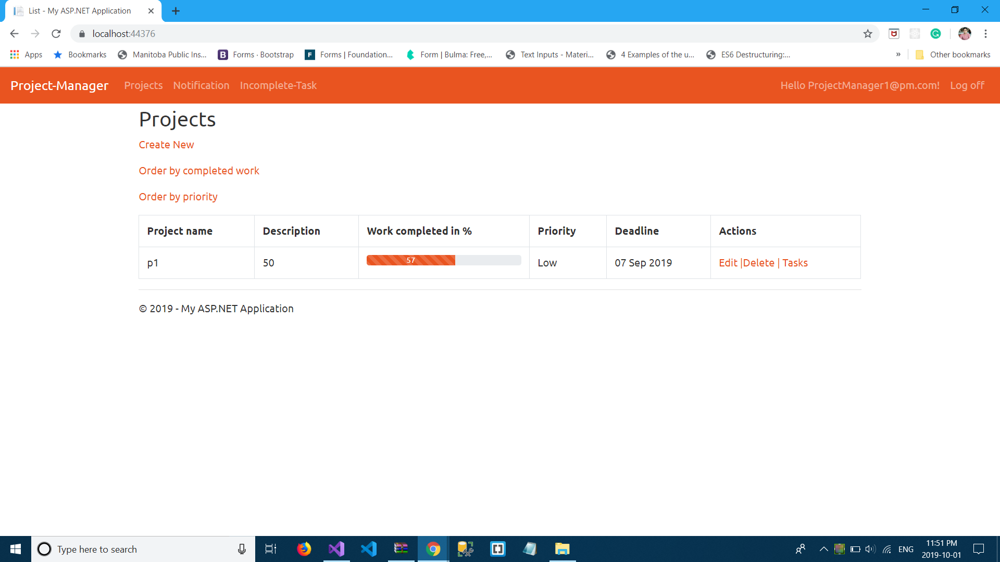
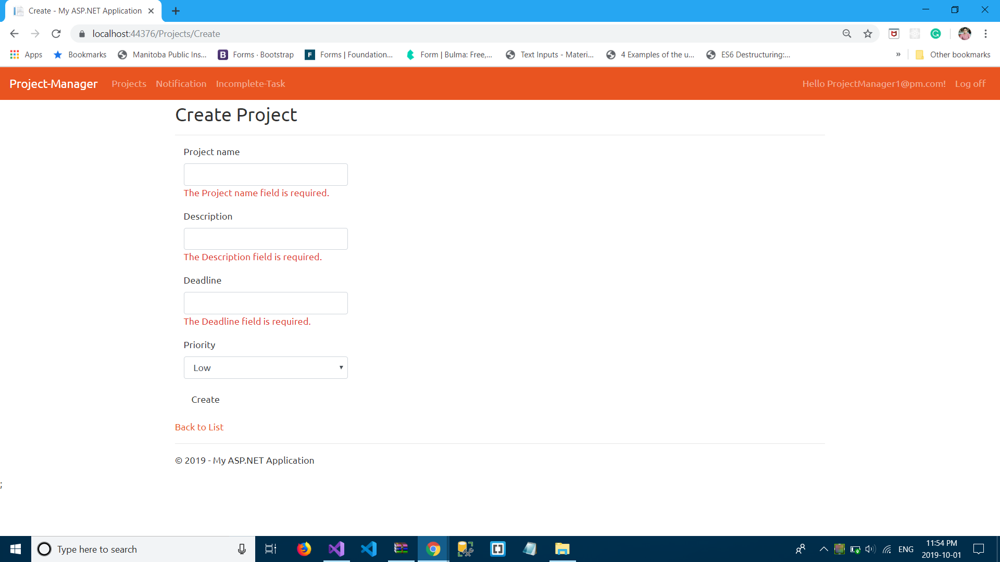
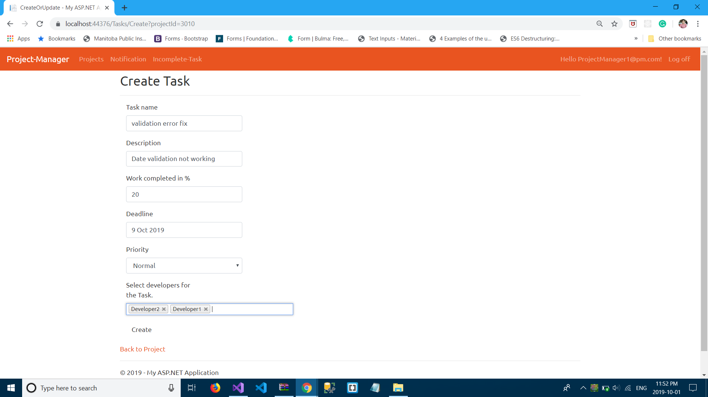
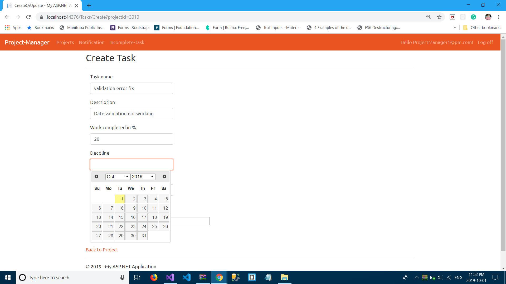
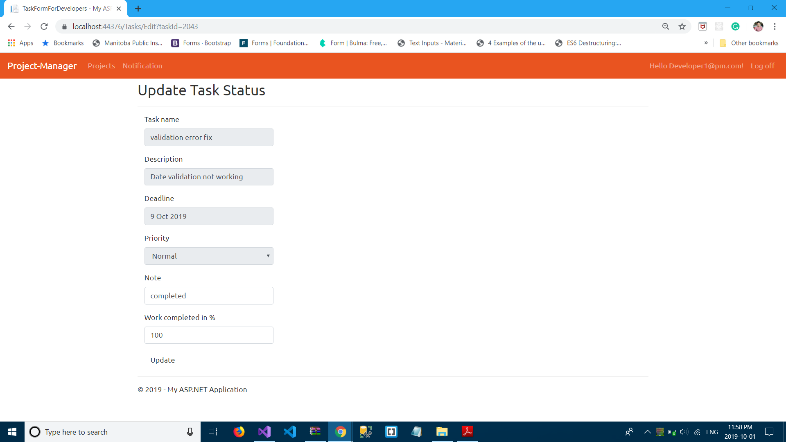
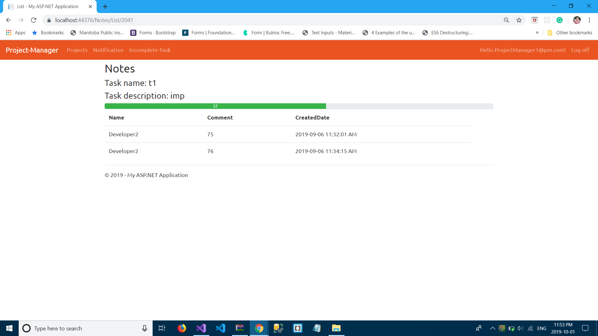
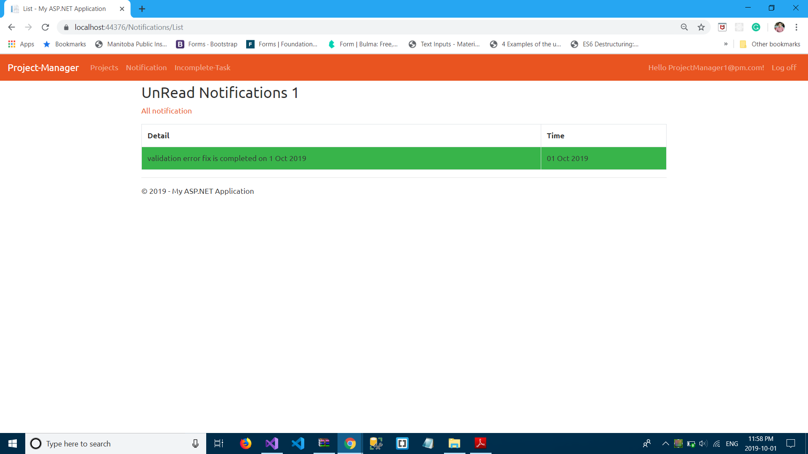
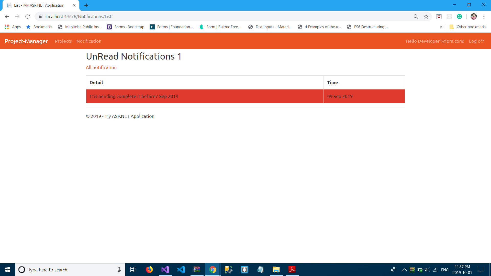

# Project-Management
## Technologies used
1. Asp.net MVC
2. C#
3. Bootstrap
4. JQuery
5. Choosen.js
6. DatePicker
##Description:
• Successfully developed web app which has the potential to create, update and generate list of projects and tasks based on user roles and privileges.
• Implemented notification system which notifies the users regarding updates and working deadlines.
• App shows the graphical progress bar which contains current completed work percentage of task or project.
## Screen Shots
1. Login

  

2. Register

  
  
3. Create project

  
  
4. Project List

  
  
5. Validations

  
  
6. Task Form

  
  
7. DatePicker

  
  
8. Devloper Update Form

  
  
9. Notes

  
  
10. Completed Notification

  
  
11. Incomplete Notification For Developer

  
